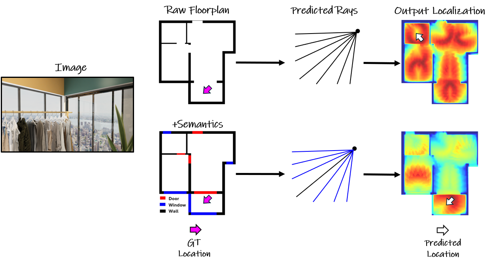

# Supercharging Floorplan Localization with Semantic Rays

<p align="center">
  
</p>

This repository contains the official implementation of the following paper:

**Supercharging Floorplan Localization with Semantic Rays**  
**Authors**: Yuval Grader, Hadar Averbuch-Elor  
<a href="https://arxiv.org/pdf/2507.09291" target="_blank">Paper</a> | <a href="https://arxiv.org/abs/2507.09291" target="_blank">arXiv</a> | <a href="https://tau-vailab.github.io/SemRayLoc/" target="_blank">Project Page</a>

The framework leverages both semantic and depth information for accurate camera pose estimation in indoor environments.

---

## Abstract
Floorplans provide a compact representation of the building's structure, revealing not only layout information but also detailed semantics such as the locations of windows and doors. However, contemporary floorplan localization techniques mostly focus on matching depth-based structural cues, ignoring the rich semantics communicated within floorplans. In this work, we introduce a semantic-aware localization framework that jointly estimates depth and semantic rays, consolidating over both for predicting a structural-semantic probability volume. Our probability volume is constructed in a coarse-to-fine manner: We first sample a small set of rays to obtain an initial low-resolution probability volume. We then refine these probabilities by performing a denser sampling only in high-probability regions and process the refined values for predicting a 2D location and orientation angle. We conduct an evaluation on two standard floorplan localization benchmarks. Our experiments demonstrate that our approach substantially outperforms state-of-the-art methods, achieving significant improvements in recall metrics compared to prior works. Moreover, we demonstrate that our framework can easily incorporate additional metadata such as room labels, enabling additional gains in both accuracy and efficiency.

---

## Data Preparation Pipeline

For each dataset (S3D, ZInD):

1. **Download the dataset**
   - Use the official dataset pages:
     - [Structured3D Download](https://structured3d-dataset.org/)
     - [ZInD Download](https://zind.cs.princeton.edu/)
   - You can use the provided script to automate download and extraction for S3D:
     ```bash
     python data_utils/s3d/download_and_extract.py
     ```

2. **Create Processed Datasets**
   - After downloading, process the raw data to create a processed folder for each dataset:
     ```bash
     # For S3D
     python data_utils/s3d/create_data_sets.py
     # For ZInD (adapt as needed for ZInD structure)
     python data_utils/zind/create_data_sets.py
     ```
   - This will create a `processed` folder with the required structure.

3. **Resize Images**
   - Resize all images to the required input size (360x640) to match prior work:
     ```bash
     python data_utils/resize_images.py
     ```

4. **Generate Raycast Maps**
   - Generate grid raycasts for floorplan maps:
     ```bash
     python -m data_utils.generate_maps_grid_raycasts_multi_thread
     ```

5. **Map Room Types**
   - Use the helper functions in `modules/semantic/semantic_mapper.py` to map room types as needed for your dataset.
   - **Important for ZInD**: Since ZInD contains over 250 different room types, we use a semantic mapper to consolidate these into a more manageable set of semantic categories. This mapping is essential for effective training and evaluation.

---

## Training

Our training framework is built on **PyTorch Lightning**, providing robust training capabilities with automatic logging and checkpointing.

### Configuration
- Each training run is controlled by a config file (YAML) in `Train_models/configurations/S3D/` or the corresponding dataset folder.
- Adjust the main parameters (e.g., learning rate, batch size, loss weights, etc.) in the config file before training.

### Training Process
1. **Start Training**:
   ```bash
   python -m Train_models.Train
   ```

2. **Monitor Training**:
   - **TensorBoard**: Training progress is automatically logged to TensorBoard. Launch TensorBoard to monitor:
     ```bash
     tensorboard --logdir lightning_logs
     ```
   - **Checkpoints**: PyTorch Lightning automatically saves checkpoints in the `lightning_logs/` directory
   - **Logs**: Detailed training logs are saved in the `logs/` directory

3. **Training Features**:
   - **Automatic Mixed Precision**: Enabled by default for faster training
   - **Gradient Clipping**: Configured to prevent gradient explosion
   - **Early Stopping**: Monitors validation loss to prevent overfitting
   - **Model Checkpointing**: Saves best model based on validation metrics

### Training Tips
- Monitor the training curves in TensorBoard to ensure proper convergence
- Adjust learning rate and batch size based on your hardware capabilities
- Use the validation set to tune hyperparameters
- Check the `lightning_logs/` directory for saved model checkpoints

---

## Evaluation
- For evaluation, specify the evaluation config, weights directory, and results directory in the evaluation script/config.
- Run evaluation:
  ```bash
  python -m evaluation.eval_localization
  ```

---

## Pretrained Weights
- Download pretrained weights and place them in the appropriate directory (e.g., `modules/weights/s3d/`).
- [Download weights here](<https://drive.google.com/drive/folders/1BkQiuEPQ4GQyKyy8vfPAu5-WnJWesQUN?usp=sharing>)

## Requirements
See `requirements.txt` for all dependencies.

---

## Citation
If you use this code, please cite our paper:

```bibtex
@misc{grader2025superchargingfloorplanlocalizationsemantic,
      title={Supercharging Floorplan Localization with Semantic Rays}, 
      author={Yuval Grader and Hadar Averbuch-Elor},
      year={2025},
      eprint={2507.09291},
      archivePrefix={arXiv},
      primaryClass={cs.CV},
      url={https://arxiv.org/abs/2507.09291}, 
}
```
